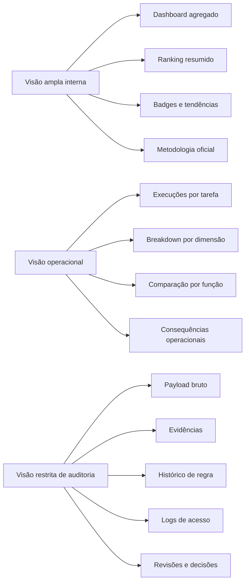
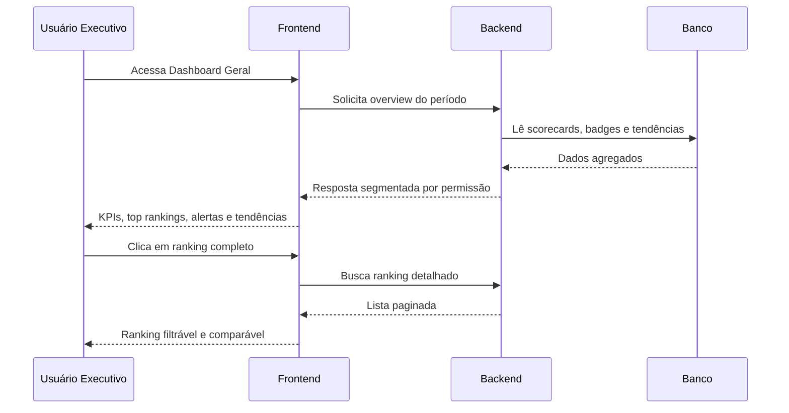
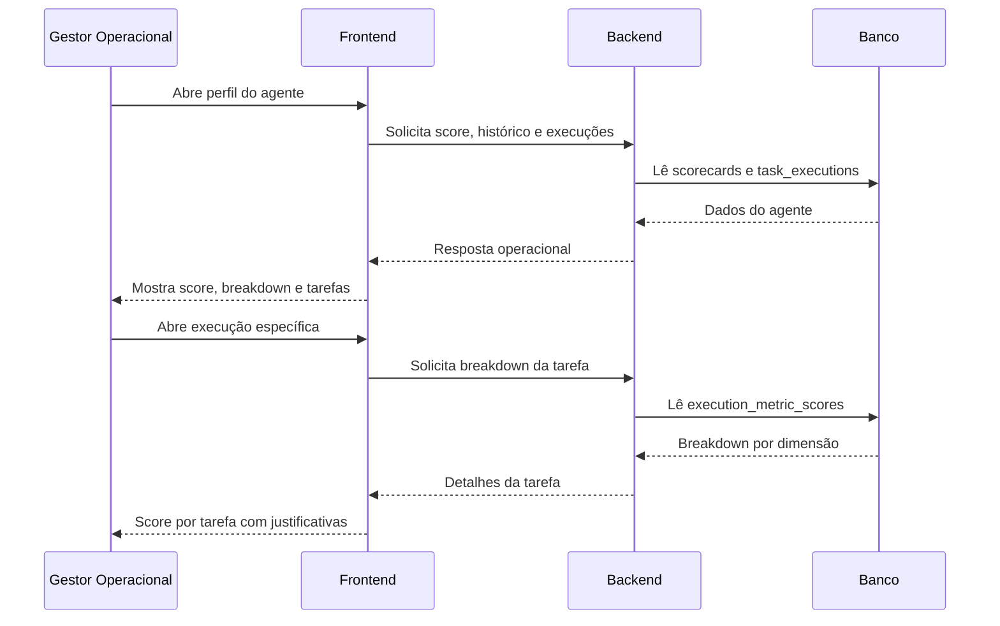
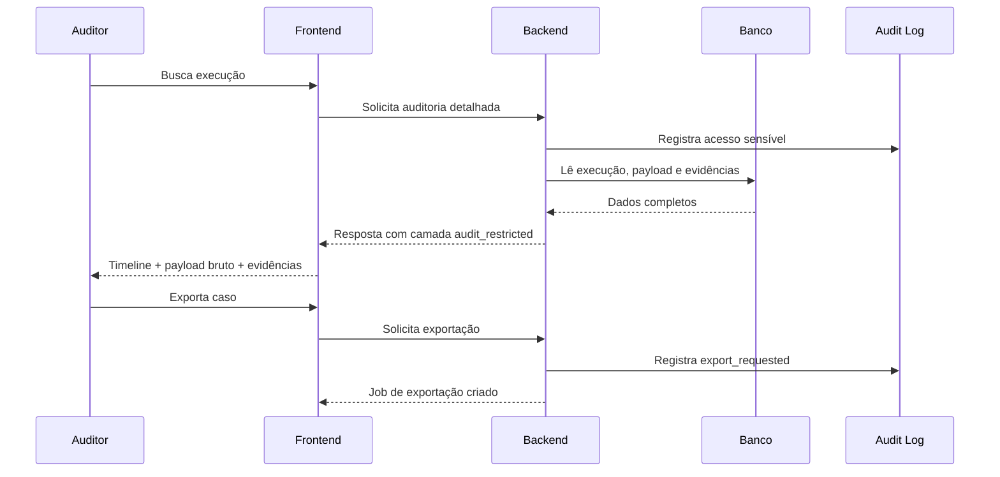
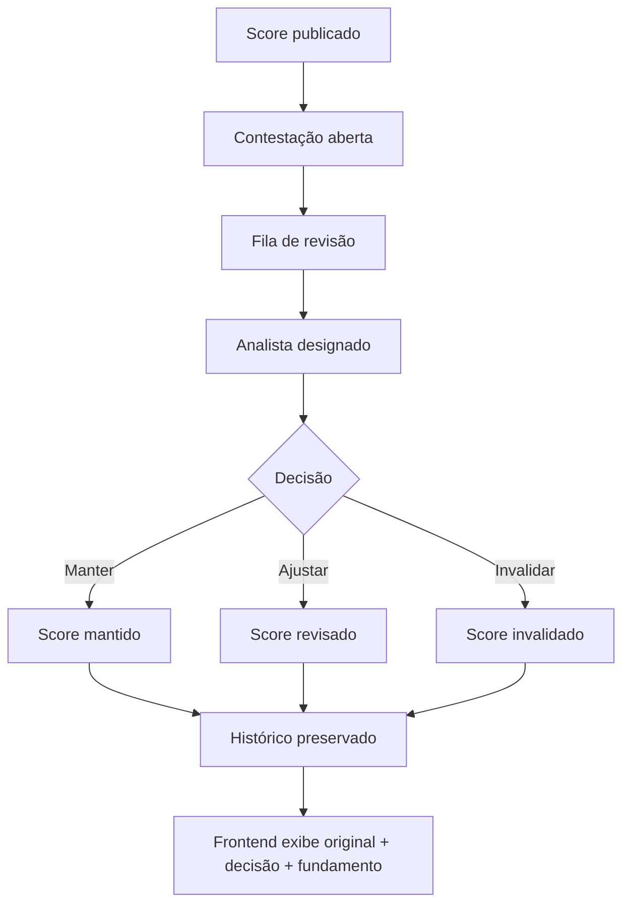
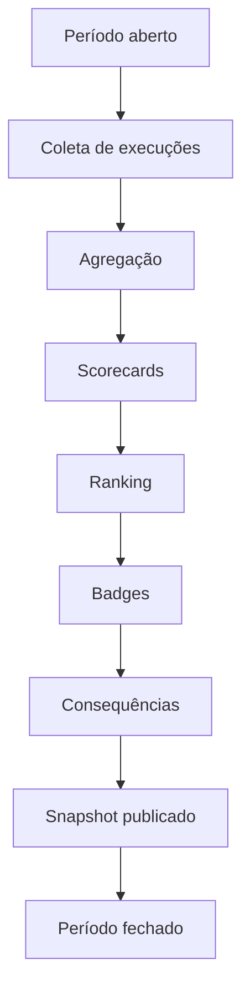

# Mapa Visual das Telas e Fluxos — Ranking de Eficiência de Agentes Virtuais

## 1. Visão Geral

Este documento traduz a arquitetura funcional do sistema em mapas de navegação, telas, fluxos de uso e relacionamentos entre módulos. O objetivo é facilitar:
- alinhamento entre produto, design e engenharia;
- validação de cobertura funcional;
- planejamento de implementação;
- leitura rápida dos caminhos principais e caminhos restritos.

---

## 2. Mapa Macro de Navegação

```mermaid
flowchart TD
    A[Login / SSO] --> B[Dashboard Geral]
    B --> C[Central de Ranking]
    B --> D[Agentes]
    B --> E[Equipes]
    B --> F[Funções]
    B --> G[Badges]
    B --> H[Consequências Operacionais]
    B --> I[Auditoria]
    B --> J[Revisões e Apelações]
    B --> K[Administração de Regras]

    C --> C1[Ranking de Agentes]
    C --> C2[Ranking de Equipes]
    C --> C3[Ranking de Funções]
    C --> C4[Comparativos]

    D --> D1[Perfil do Agente]
    D1 --> D2[Execuções / Tarefas]
    D1 --> D3[Histórico de Score]
    D1 --> D4[Badges]
    D1 --> D5[Consequências]
    D1 --> D6[Revisões]

    E --> E1[Perfil da Equipe]
    E1 --> E2[Ranking Interno]
    E1 --> E3[Distribuição por Faixa]
    E1 --> E4[Agentes em Risco]

    F --> F1[Perfil da Função]
    F1 --> F2[Comparação Homogênea]
    F1 --> F3[Heatmap por Equipe]

    I --> I1[Busca Auditável]
    I --> I2[Timeline de Eventos]
    I --> I3[Payload Bruto]
    I --> I4[Logs de Acesso]

    J --> J1[Fila de Revisão]
    J --> J2[Caso de Revisão]
    J2 --> J3[Decisão]
    J2 --> J4[Histórico]

    K --> K1[Políticas]
    K --> K2[Badges]
    K --> K3[Consequências]
    K --> K4[Períodos]
    K --> K5[Simulador]
```



---

## 3. Mapa por Camadas de Transparência



---

## 4. Inventário de Telas

## 4.1 Núcleo comum
1. Login / SSO
2. Dashboard Geral
3. Central de Ranking
4. Busca Global
5. Metodologia / Política oficial

## 4.2 Núcleo operacional
6. Perfil do Agente
7. Perfil da Equipe
8. Perfil da Função
9. Análise por Período
10. Consequências Operacionais

## 4.3 Núcleo de reconhecimento
11. Central de Badges
12. Histórico de Badges

## 4.4 Núcleo de governança
13. Auditoria
14. Revisões e Apelações
15. Administração de Políticas
16. Administração de Badges
17. Administração de Consequências
18. Gestão de Períodos
19. Simulador de Impacto
20. Exportações e Snapshots

---

## 5. Mapa de Hierarquia das Telas

```text
Sistema
├── Login / SSO
├── Dashboard Geral
│   ├── KPIs
│   ├── Ranking resumido
│   ├── Tendências
│   ├── Alertas
│   └── Feed de governança
├── Central de Ranking
│   ├── Agentes
│   ├── Equipes
│   ├── Funções
│   └── Comparativos
├── Agentes
│   └── Perfil do Agente
│       ├── Resumo
│       ├── Histórico temporal
│       ├── Execuções / tarefas
│       ├── Breakdown
│       ├── Badges
│       ├── Consequências
│       └── Revisões
├── Equipes
│   └── Perfil da Equipe
│       ├── Resumo
│       ├── Ranking interno
│       ├── Distribuição
│       └── Gargalos
├── Funções
│   └── Perfil da Função
│       ├── Comparativo homogêneo
│       ├── Heatmap
│       └── Outliers
├── Badges
│   ├── Catálogo
│   ├── Conquistas
│   └── Histórico
├── Consequências Operacionais
│   ├── Regras
│   ├── Eventos
│   └── Pendências
├── Auditoria
│   ├── Busca
│   ├── Timeline
│   ├── Payload bruto
│   ├── Evidências
│   └── Logs
├── Revisões e Apelações
│   ├── Fila
│   ├── Caso
│   └── Decisão
└── Administração
    ├── Políticas
    ├── Regras de badges
    ├── Regras de consequência
    ├── Períodos
    ├── Simulador
    └── Exportações
```

---

## 6. Fluxo Principal de Uso — Leitura Executiva



---

## 7. Fluxo Principal de Uso — Análise Operacional



---

## 8. Fluxo Principal de Uso — Auditoria



---

## 9. Fluxo de Revisão / Apelação



---

## 10. Fluxo de Publicação de Política


---

## 11. Fluxo de Fechamento de Período



---

## 12. Wireframe Conceitual — Dashboard Geral

```text
┌──────────────────────────────────────────────────────────────────────────────┐
│ Header: período | filtros globais | versão da política | usuário           │
├──────────────────────────────────────────────────────────────────────────────┤
│ KPI 1        │ KPI 2        │ KPI 3        │ KPI 4        │ KPI 5          │
├──────────────────────────────────────────────────────────────────────────────┤
│ Tendência Global (linha)                 │ Distribuição por Faixa (barras) │
├──────────────────────────────────────────────────────────────────────────────┤
│ Top Agentes                              │ Top Equipes                     │
├──────────────────────────────────────────────────────────────────────────────┤
│ Alertas críticos                         │ Feed de governança              │
└──────────────────────────────────────────────────────────────────────────────┘
```

---

## 13. Wireframe Conceitual — Central de Ranking

```text
┌──────────────────────────────────────────────────────────────────────────────┐
│ Header: tipo de ranking | período | equipe | função | badge | exportar     │
├──────────────────────────────────────────────────────────────────────────────┤
│ Abas: [Agentes] [Equipes] [Funções] [Comparativos]                          │
├──────────────────────────────────────────────────────────────────────────────┤
│ Busca | Score range | Score provisório | Sample size | Ordenação            │
├──────────────────────────────────────────────────────────────────────────────┤
│ Tabela principal                                                            │
│ # | Agente | Equipe | Função | Score | Delta | Badges | Amostra | Faixa    │
│ ...                                                                         │
├──────────────────────────────────────────────────────────────────────────────┤
│ Drawer lateral: breakdown do item selecionado                               │
└──────────────────────────────────────────────────────────────────────────────┘
```

---

## 14. Wireframe Conceitual — Perfil do Agente

```text
┌──────────────────────────────────────────────────────────────────────────────┐
│ Cabeçalho: nome | equipe | função | score | faixa | badges                 │
├──────────────────────────────────────────────────────────────────────────────┤
│ Evolução temporal (linha)                                                   │
├──────────────────────────────────────────────────────────────────────────────┤
│ Breakdown por dimensão              │ Consequências operacionais            │
├──────────────────────────────────────────────────────────────────────────────┤
│ Execuções recentes / score por tarefa                                       │
├──────────────────────────────────────────────────────────────────────────────┤
│ Histórico de badges                 │ Histórico de revisões                 │
└──────────────────────────────────────────────────────────────────────────────┘
```

---

## 15. Wireframe Conceitual — Auditoria

```text
┌──────────────────────────────────────────────────────────────────────────────┐
│ Busca: execução | agente | scorecard | badge | período                      │
├──────────────────────────────────────────────────────────────────────────────┤
│ Linha do tempo auditável                                                   │
├──────────────────────────────────────────────────────────────────────────────┤
│ Payload bruto                 │ Evidências / anexos                         │
├──────────────────────────────────────────────────────────────────────────────┤
│ Versão da política            │ Logs de acesso / exportação                │
├──────────────────────────────────────────────────────────────────────────────┤
│ Revisões associadas           │ Ações possíveis                            │
└──────────────────────────────────────────────────────────────────────────────┘
```

---

## 16. Fluxos de Navegação Essenciais

### 16.1 Do dashboard para causa raiz
1. Dashboard Geral
2. Ranking de agentes
3. Perfil do agente
4. Execuções recentes
5. Breakdown por tarefa
6. Auditoria, se autorizado

### 16.2 Do ranking para comparação justa
1. Ranking geral
2. Filtro por função
3. Comparativo de agentes
4. Análise por dimensão
5. Histórico por período

### 16.3 Da badge para prova
1. Central de Badges
2. Badge específica
3. Agentes contemplados
4. Scorecard de origem
5. Evidência e regra aplicada

### 16.4 Da consequência para ação
1. Consequências Operacionais
2. Evento de consequência
3. Regra de origem
4. Scorecard associado
5. Confirmação ou dispensa

---

## 17. Mapa de Estados Visuais

| Estado | Onde aparece | Objetivo |
|---|---|---|
| Loading | Todas as consultas | Informar processamento |
| Empty state | Filtros sem resultado | Orientar próximo passo |
| Sem permissão | Telas restritas | Proteger informação |
| Score provisório | Ranking, perfis | Alertar baixa amostra |
| Período aberto | Análise temporal | Evitar interpretação final |
| Dados reprocessados | Scorecards, auditoria | Transparência histórica |
| Badge revogada | Perfil do agente, badges | Preservar histórico |

---

## 18. Dependências entre Telas

- Dashboard depende de scorecards publicados, badges e alertas.
- Ranking depende de scorecards, filtros e snapshots.
- Perfil do agente depende de scorecards + task_executions + badges + consequências.
- Auditoria depende de task_executions + ingestion_events + evidências + audit_logs.
- Revisões dependem de scorecards ou execuções específicas.
- Administração depende de políticas, thresholds, badges e períodos.

---

## 19. Resultado Esperado

O mapa visual deve orientar design e engenharia para uma implementação em que:
- o usuário comum entende o ranking;
- o gestor entende o motivo;
- o auditor comprova o histórico;
- o administrador governa as regras;
- todas as camadas convivem sem conflito de significado.